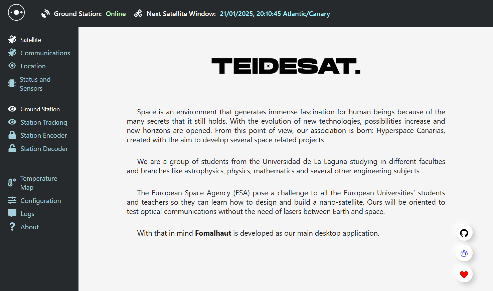

# Fomalhaut

> From TEIDESAT Project and Hyperspace Canarias

## Documentation

[UML Documentation](https://drive.google.com/file/d/13AXM-qIjfROxe5EaNRkCwk9KPloPaoG-/view?usp=sharing)

## Description

This software is designed as a general purpose cross-platform application for the TeideSat Project. The interface (`React`)
will connect to the local server (`java-spring`) by default or any other remote server (_note, for debugging purposes, the
interface can be accessed through the browser_).

## Developed Features

## Usage

`git clone https://github.com/Teidesat/Fomalhaut.git`

`cd Fomalhaut`

`npm install`

`npm run dev`

## Usage (Docker)

### 0. Requisitos previos

- Tener instalado **Docker** (y **Docker Desktop** si estás en Windows o Mac).

`git clone https://github.com/Teidesat/Fomalhaut.git`

`cd Fomalhaut`

`docker build -t fomalhaut-frontend .`

`docker run -it --rm -p 20001:20001 fomalhaut-frontend npm run dev -- --host 0.0.0.0`

Presiona **`Ctrl + C`** en la terminal donde se está ejecutando el contenedor.
